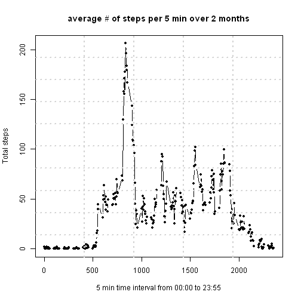

This is an R Markdown document explaining and finishing course project 1 of the data science specialization course Reproducible research.  

The code of the project splits into 5 main parts i.e. 

1. Load libraries getting and cleaning data 
2. Analyze mean total numbers of steps per day 
3. Analyze average daily activity pattern
4. Manupulating the data for missing values
5. Compare results with missing data to the one with filled in data. 


First we start by data cleaning and loading libraries needed.
------------------

You can download the data file from
[here]("https://d396qusza40orc.cloudfront.net/repdata%2Fdata%2Factivity.zip")
into your working directory if wanted.

**Install packages sentences are commented out in the first code chunk.  
If you are missing below packages you need to install them.**


```r
#install.packages("sqldf")
#install.packages("timeDate")
#install.packages("lattice")
download.file("http://d396qusza40orc.cloudfront.net/repdata%2Fdata%2Factivity.zip", "activity.zip")
library("sqldf")
library("timeDate")
library("lattice") 
tmpdir=unzip("activity.zip")
amd <- read.csv("./activity.csv")
amd$interval <- sprintf("%04d", amd$interval) 
```


Know we address point 2 - mean total numbers of steps per day 
------------------


```r
#number of measured dates
all_Dates <- sqldf("select distinct date from amd")
num_dates_measured <- dim(all_Dates)[1]

######
##Find total steps every day ignoring missing values 
tot_step_day <- sqldf("select sum(steps) as steps, date from amd where steps is not null group by date")


mean_step <- mean(tot_step_day$steps)
median_step <- median(tot_step_day$steps)
```

The number of dates measured is 61 and the average steps and median steps per day are 10766 and 10765

*lets take a quick look at total steps per day in table format* 


```r
tot_step_day[,c(2,1)]
```

```
#          date steps
# 1  2012-10-02   126
# 2  2012-10-03 11352
# 3  2012-10-04 12116
# 4  2012-10-05 13294
# 5  2012-10-06 15420
# 6  2012-10-07 11015
# 7  2012-10-09 12811
# 8  2012-10-10  9900
# 9  2012-10-11 10304
# 10 2012-10-12 17382
# 11 2012-10-13 12426
# 12 2012-10-14 15098
# 13 2012-10-15 10139
# 14 2012-10-16 15084
# 15 2012-10-17 13452
# 16 2012-10-18 10056
# 17 2012-10-19 11829
# 18 2012-10-20 10395
# 19 2012-10-21  8821
# 20 2012-10-22 13460
# 21 2012-10-23  8918
# 22 2012-10-24  8355
# 23 2012-10-25  2492
# 24 2012-10-26  6778
# 25 2012-10-27 10119
# 26 2012-10-28 11458
# 27 2012-10-29  5018
# 28 2012-10-30  9819
# 29 2012-10-31 15414
# 30 2012-11-02 10600
# 31 2012-11-03 10571
# 32 2012-11-05 10439
# 33 2012-11-06  8334
# 34 2012-11-07 12883
# 35 2012-11-08  3219
# 36 2012-11-11 12608
# 37 2012-11-12 10765
# 38 2012-11-13  7336
# 39 2012-11-15    41
# 40 2012-11-16  5441
# 41 2012-11-17 14339
# 42 2012-11-18 15110
# 43 2012-11-19  8841
# 44 2012-11-20  4472
# 45 2012-11-21 12787
# 46 2012-11-22 20427
# 47 2012-11-23 21194
# 48 2012-11-24 14478
# 49 2012-11-25 11834
# 50 2012-11-26 11162
# 51 2012-11-27 13646
# 52 2012-11-28 10183
# 53 2012-11-29  7047
```

*Now visiually with histogram* 


```r
##plot the histogram
hist(tot_step_day$steps, breaks = 20, xlab = "# Total steps", ylab = "# of days", 
     main = "Histogram of Steps taken per day")
abline(v=mean_step,col="red", lwd = 4)
```

 


Know we address point 3 -  average daily activity
------------------


```r
avg_step_interval <- sqldf("select avg(steps) as avg_int_steps, interval from amd where steps is not null group by interval")

plot(avg_step_interval$interval,avg_step_interval$avg_int_steps, type="b", lwd = 1,pch = 20,
     xlab = "5 min time interval from 00:00 to 23:55", ylab = "Total steps", main = "average # of steps per 5 min over 2 months")
##put grid on for the fun.
grid(5, 10, lwd = 2)
```

 

```r
##Find the max steps taken interval 

indexmax <- which.max(avg_step_interval$avg_int_steps)
max_steps_interval<-avg_step_interval[indexmax,]

max_steps_interval
```

```
#     avg_int_steps interval
# 104      206.1698     0835
```

Know we address point 4 -  Manupulating the data for missing values and compare it to original data
------------------


```r
##Analyze missing data

tot_miss_values <- sqldf("select count(*) as tot_missing_Values from amd where steps is null")

all_date_no_Na <- sqldf("select distinct date from amd where steps is not null")
num_dates_no_na <- dim(all_date_no_Na)[1]

dates_with_null <- sqldf("select distinct date from amd where steps is null")
num_dates_na <- dim(dates_with_null)[1]

dates_with_null_count <- sqldf("select date ,count(*) from amd where steps is null group by date")

##seems to be 8 days where there are null measures and all time intervals are null there

## reconstruct the dataset by filling in missing dates by average of other days interval round to nearest step 

data_Set_rc <- sqldf("select a.date,a.interval,a.steps,ai.avg_int_steps, case when a.steps is null then round(ai.avg_int_steps,0) else a.steps end steps_com
                     from amd a left join avg_step_interval ai on a.interval = ai.interval")

##look at part of the results 
data_Set_rc[data_Set_rc$interval == 1545,]
```

```
#             date interval steps avg_int_steps steps_com
# 190   2012-10-01     1545    NA      98.66038        99
# 478   2012-10-02     1545     0      98.66038         0
# 766   2012-10-03     1545    88      98.66038        88
# 1054  2012-10-04     1545     0      98.66038         0
# 1342  2012-10-05     1545   172      98.66038       172
# 1630  2012-10-06     1545     0      98.66038         0
# 1918  2012-10-07     1545    80      98.66038        80
# 2206  2012-10-08     1545    NA      98.66038        99
# 2494  2012-10-09     1545    76      98.66038        76
# 2782  2012-10-10     1545   340      98.66038       340
# 3070  2012-10-11     1545    78      98.66038        78
# 3358  2012-10-12     1545   365      98.66038       365
# 3646  2012-10-13     1545    18      98.66038        18
# 3934  2012-10-14     1545   533      98.66038       533
# 4222  2012-10-15     1545     0      98.66038         0
# 4510  2012-10-16     1545     0      98.66038         0
# 4798  2012-10-17     1545     0      98.66038         0
# 5086  2012-10-18     1545   127      98.66038       127
# 5374  2012-10-19     1545    80      98.66038        80
# 5662  2012-10-20     1545     0      98.66038         0
# 5950  2012-10-21     1545     0      98.66038         0
# 6238  2012-10-22     1545     0      98.66038         0
# 6526  2012-10-23     1545   276      98.66038       276
# 6814  2012-10-24     1545   156      98.66038       156
# 7102  2012-10-25     1545     0      98.66038         0
# 7390  2012-10-26     1545     0      98.66038         0
# 7678  2012-10-27     1545     0      98.66038         0
# 7966  2012-10-28     1545     0      98.66038         0
# 8254  2012-10-29     1545     0      98.66038         0
# 8542  2012-10-30     1545    33      98.66038        33
# 8830  2012-10-31     1545     0      98.66038         0
# 9118  2012-11-01     1545    NA      98.66038        99
# 9406  2012-11-02     1545     0      98.66038         0
# 9694  2012-11-03     1545     0      98.66038         0
# 9982  2012-11-04     1545    NA      98.66038        99
# 10270 2012-11-05     1545     0      98.66038         0
# 10558 2012-11-06     1545     0      98.66038         0
# 10846 2012-11-07     1545   266      98.66038       266
# 11134 2012-11-08     1545   322      98.66038       322
# 11422 2012-11-09     1545    NA      98.66038        99
# 11710 2012-11-10     1545    NA      98.66038        99
# 11998 2012-11-11     1545    19      98.66038        19
# 12286 2012-11-12     1545     0      98.66038         0
# 12574 2012-11-13     1545     0      98.66038         0
# 12862 2012-11-14     1545    NA      98.66038        99
# 13150 2012-11-15     1545     0      98.66038         0
# 13438 2012-11-16     1545     0      98.66038         0
# 13726 2012-11-17     1545     0      98.66038         0
# 14014 2012-11-18     1545   335      98.66038       335
# 14302 2012-11-19     1545    19      98.66038        19
# 14590 2012-11-20     1545     0      98.66038         0
# 14878 2012-11-21     1545     0      98.66038         0
# 15166 2012-11-22     1545   532      98.66038       532
# 15454 2012-11-23     1545   482      98.66038       482
# 15742 2012-11-24     1545   522      98.66038       522
# 16030 2012-11-25     1545     0      98.66038         0
# 16318 2012-11-26     1545     0      98.66038         0
# 16606 2012-11-27     1545     0      98.66038         0
# 16894 2012-11-28     1545     0      98.66038         0
# 17182 2012-11-29     1545   310      98.66038       310
# 17470 2012-11-30     1545    NA      98.66038        99
```

```r
tot_step_day_rc <- sqldf("select sum(steps_com) as steps, date from data_Set_rc group by date")

mean_step_rcd <- mean(tot_step_day_rc$steps)
mean_step_rcd
```

```
# [1] 10765.64
```

```r
median_step_rcd <- median(tot_step_day_rc$steps)
median_step_rcd
```

```
# [1] 10762
```

```r
##plot a histogram of the new dataset
hist(tot_step_day_rc$steps, breaks = 20, xlab = "Number of days", ylab = "Total steps", 
     main = "Histogram of Steps taken per day")
abline(v=mean_step,col="red", lwd = 1)
```

 

```r
##steps difference in mean and median in reconstructed data and normal data

mean_dif <- mean_step_rcd - mean_step
mean_dif
```

```
# [1] -0.549335
```

```r
median_dif <- median_step_rcd - median_step
median_dif
```

```
# [1] -3
```

```r
## total impact on the data

total_impact_steps <- sum(tot_step_day_rc$steps) -  sum(tot_step_day$steps)
total_impact_steps
```

```
# [1] 86096
```


Know we address point 5 - creating factor variables and makeing panel plot
------------------


```r
tim_int <- sqldf("select interval ,count(*) from amd where steps is null group by interval")

data_Set_rc$day<-factor(weekdays(as.Date(data_Set_rc$date)))

data_Set_rc$is_weekday<-factor(isWeekday(as.Date(data_Set_rc$date)),levels=c(TRUE,FALSE),labels=c("Weekdays","Weekends"))

day_data <- sqldf("select day,interval,avg(steps_com) as steps from data_Set_rc group by day,interval")

weekend_week_data <- sqldf("select is_weekday,interval,avg(steps_com) as steps from data_Set_rc group by is_weekday,interval")

#look at part of new dataset
weekend_week_data[260:300,]
```

```
#     is_weekday interval steps
# 260   Weekdays     2135    16
# 261   Weekdays     2140     7
# 262   Weekdays     2145     7
# 263   Weekdays     2150     8
# 264   Weekdays     2155     3
# 265   Weekdays     2200     1
# 266   Weekdays     2205     4
# 267   Weekdays     2210     6
# 268   Weekdays     2215    11
# 269   Weekdays     2220     9
# 270   Weekdays     2225    10
# 271   Weekdays     2230    12
# 272   Weekdays     2235     2
# 273   Weekdays     2240     0
# 274   Weekdays     2245     0
# 275   Weekdays     2250     1
# 276   Weekdays     2255     2
# 277   Weekdays     2300     3
# 278   Weekdays     2305     3
# 279   Weekdays     2310     0
# 280   Weekdays     2315     1
# 281   Weekdays     2320     1
# 282   Weekdays     2325     1
# 283   Weekdays     2330     3
# 284   Weekdays     2335     2
# 285   Weekdays     2340     2
# 286   Weekdays     2345     0
# 287   Weekdays     2350     0
# 288   Weekdays     2355     1
# 289   Weekends     0000     0
# 290   Weekends     0005     0
# 291   Weekends     0010     0
# 292   Weekends     0015     0
# 293   Weekends     0020     0
# 294   Weekends     0025     3
# 295   Weekends     0030     0
# 296   Weekends     0035     0
# 297   Weekends     0040     0
# 298   Weekends     0045     0
# 299   Weekends     0050     0
# 300   Weekends     0055     0
```

```r
#Plot the panel plot

xyplot(steps~as.numeric(interval) | is_weekday, data=weekend_week_data,layout = c(1,2),type="b", lwd = 1,pch = 20,
       xlab = "5 min time interval from 00:00 to 23:55", ylab = "Total number of steps", main = "weekend vs weekdays activity")
```

 
